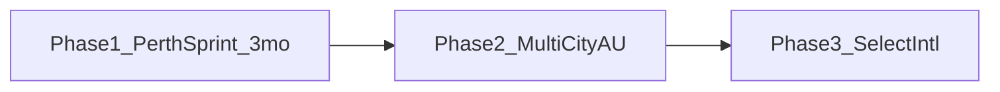

# Next Train — Business & Marketing Plan (Evans Studios)

**For sharing:** This is the working business/marketing plan for Next Train.  
**Especially useful for Simon (Design):** §3 Marketing (positioning, audiences, channels, QR guerrilla, creative system, calendar) · competitor notes in §2.2 · message pillars · store listing / creative cues. Financial scenarios (§4) are optional context.

**Status:** Living draft from product/strategy discussion (Aug 2026). Plain English first, then acronyms so jargon stays learnable.

**Assumptions locked for planning:** Bootstrapped / low-capital studio; keep ads + one-time **A$3.99** remove-ads (no subscription in the base model); founder builds (no contractors by default); **iOS upfront** in the 90-day Perth sprint; aggressive ~3-month Perth beachhead then city #2.

**Product today:** Perth/Transperth “when to leave” utility — Nearby board + saved Journeys; free with ads; Android remove-ads **in-app purchase** (**IAP**); web / **progressive web app** (**PWA**, add-to-home-screen) companion; iOS planned in sprint; unofficial Transperth live data feed (**application programming interface**, **API**).

**How this plan uses jargon:** Plain English first, then what the letters stand for, then the short form. Example: “what a user is worth over time (**lifetime value**, **LTV**)”. After the first use, either form is fine.

### Quick glossary (read once — sorted by short form A–Z)

| Short form | What the letters stand for | Plain English |
| ---------- | -------------------------- | ------------- |
| **API** | application programming interface | Live data feed / programming interface |
| **ARPDAU** | average revenue per daily active user | Ad money per active user per day |
| **ASO** | app store optimisation | Making the Play/App Store listing findable |
| **B2B** | business-to-business | Selling to / partnering with businesses |
| **CAC** | customer acquisition cost | Cost to acquire one paying/valuable customer |
| **CPI** | cost per install | What you pay for one install from ads |
| **DAU** | daily active users | People who opened the app on a typical day |
| **eCPM** | effective cost per mille (“mille” = thousand) | Rough ad rate (earnings per thousand ad views) |
| **GTM** | go-to-market | How you take the product to market |
| **IAP** | in-app purchase | One-time (or store) purchase inside the app |
| **LTV** | lifetime value | What a user is worth over time (ads + purchases) |
| **MAU** | monthly active users | People who opened the app at least once in a month |
| **P&L** | profit and loss | Monthly money in vs money out |
| **PR** | public relations | Press and media coverage |
| **PTA** | Public Transport Authority | Western Australia’s transport agency |
| **PWA** | progressive web app | Web app you can add to the home screen |
| **SEO** | search engine optimisation | Getting found via Google web search |
| **ToS** | terms of service | Rules of use for a service |
| **UA** | user acquisition | Paid ads / effort to get new users |

---

## 1. Executive summary

**Evans Studios** positions **Next Train** as the commute micro-app that answers one job better than maps or agency apps: *when should I leave home for my next train?*

**Strategy:** Sprint **Perth for ~3 months** (prove stickiness + monetization + live production) while building multi-city plumbing in parallel → expand to **Australian capitals** fast → then selective **overseas** cities where live departure data and “leave-by” demand exist.

**How money works:** People open the app often (ad income) + some pay once to remove ads forever (**in-app purchase**, **IAP**). Only spend on paid install ads (**user acquisition**, **UA**) when what a user is worth over time (**lifetime value**, **LTV**) clearly beats what you pay to get them (**cost per install**, **CPI**).

**Three-year aim:** Become the default “leave by” train app for regular rail commuters in every city we ship—not a generic trip planner.

---

## 2. Business plan

### 2.1 Vision & mission

- **Vision:** The world’s simplest leave-home train companion—city by city.
- **Mission:** Give every regular rail rider a trustworthy leave-by time in under two seconds, with privacy-light defaults and honest monetization.
- **Brand:** Evans Studios = craft-led indie utility apps; Next Train = calm, local, commute-critical.

### 2.2 Market opportunity

| Layer                           | Scope                                                                                                                 | Rough scale (planning)                                                                                                                                                                           |
| ------------------------------- | --------------------------------------------------------------------------------------------------------------------- | ------------------------------------------------------------------------------------------------------------------------------------------------------------------------------------------------ |
| **Starting market** (beachhead) | Perth Transperth rail                                                                                                 | ~60M train boardings/yr (Public Transport Authority / **PTA** 2023–24); roughly **80–150k** regular smartphone rail users as a realistic reachable pool (serviceable available market / **SAM**) |
| **Australia**                   | Sydney, Melbourne, Brisbane, Adelaide, Canberra, Hobart (+ regional where data feeds allow)                           | Much larger than Perth; **denser third-party competition in Sydney/Melbourne** (see competitor check below)                                                                                      |
| **Overseas**                    | Cities with open/reliable live rail feeds (**application programming interfaces**, **APIs**) + strong commute culture | Opportunistic; data quality decides if we enter                                                                                                                                                  |

**Category:** Small commute utility — competes for attention with Google/Apple Maps, official transport apps, TripView/NextThere-style apps, Citymapper—but wins on **speed-to-answer** and **saved leave-by journeys**, not full trip planning across every mode.

#### Competitor check (researched — not guesswork)

**Verdict:** “Tougher competition in Sydney/Melbourne” is **true for this category**, not empty speculation. Those cities have several strong, well-reviewed departure / commute apps plus official fare apps. Perth is thinner for *polished third-party leave-by / saved-trip* apps, but not empty.

**Sydney & Melbourne (crowded)**

| App              | What it is                                                                                                                        | Overlap with Next Train                              |
| ---------------- | --------------------------------------------------------------------------------------------------------------------------------- | ---------------------------------------------------- |
| **TripView**     | Paid (Lite free); Sydney, Melbourne, Brisbane; ~4.8★; saved trips, offline timetables, alarms, delays/vehicle map where available | High — daily saved commute favourite in those cities |
| **NextThere** | Free (+ Pro **subscription**); **Australian indie** (AppJourney Pty Ltd, NSW) with **AU + NZ + US** coverage; **iOS only** (no Play Store); “what’s next” departure board | High on iPhone — absent on Android |
| **Citymapper**   | Free; **Sydney & Melbourne only** in AU; smart routing / commute                                                                  | Medium–high for “when do I leave / which service”    |
| **AnyTrip**      | Free + ads / remove-ads; live vehicle map                                                                                         | Medium — “is it coming?” not leave-home buffer       |
| **Transit**      | Free (+ optional sub); major cities; nearby departures                                                                            | Medium                                               |
| **Official**     | Opal Travel (NSW), PTV / myki (VIC)                                                                                               | Lower for leave-by; strong for fares/tickets         |
| **Google Maps**  | Everywhere                                                                                                                        | Medium — good planner; slower for repeat commute     |
| **Newer locals** | e.g. HopON (Melbourne-focused live countdowns)                                                                                    | Medium — nearby board / favourites                   |

Sources checked: TripView / NextThere / Citymapper store & sites; Transport for NSW “endorsed apps”; July 2026 AU transit-app comparison roundups. **Correction:** NextThere’s own site/App Store positioning is iOS (iPhone, iPad, Apple Watch); a Play Store search for “NextThere” returning nothing matches that — treat them as a strong **iPhone** competitor, not an Android one, until/unless they ship Android.

**Perth (thinner third-party field, still not a vacuum)**

| App / product | Notes |
| ------------- | ----- |
| **Official Transperth app** | Journey plan, live tracking, alerts — default incumbent |
| **NextThere** | Perth / Transperth on **iOS**; **not found on Google Play** — Android users largely don’t meet them |
| **Google Maps** | Default planner |
| **Perth Transit: Bus & Rail** (and similar) | Offline schedules / planner; listing notes **no live data** via public feed |
| **Niche** | e.g. Home Assistant / scraper libraries — not mass-market mobile competitors |
| **TripView** | **Not** in Perth (Syd / Mel / Bris only) |
| **Citymapper** | **Not** in Perth |

**Why this matters for Evans Studios**

- Sydney/Melbourne = bigger market **and** you must beat or niche against TripView, Citymapper, and (on iPhone) NextThere — expect harder **app store optimisation (**ASO**)** and paid ads (**user acquisition**, **UA**).
- Perth = better beachhead: no TripView/Citymapper; official Transperth + Maps on all phones; **NextThere mainly takes iPhone share**. Next Train’s **Android-first** posture is a real gap to own while you still win on **leave-home buffer + Journeys + live delays**.
- Data irony: NSW/VIC often have **better open live feeds** (easier to build) but **harder marketing**; Perth live data is more unofficial/fragile but the shelf is less crowded for a leave-by specialist — especially on Android.

#### How Perth live data works (Next Train vs NextThere)

**What is public and official**

- Transperth publishes **static** timetable/spatial data as **GTFS** (schedules, stops, routes) via their Spatial Data Access page — fine for “what *should* run,” not live delays.
- There is **no official public GTFS-Realtime / developer live API** for Transperth (unlike Transport for NSW / Victoria open data). Community libraries (e.g. `aiotransperth`) state this explicitly: live delay data effectively lives only behind Transperth’s own website / services.

**What Next Train uses**

- Unofficial **LiveTimes** SOAP service: `livetimes.transperth.wa.gov.au` → `GetTimesForStation` (see [`lib/train-times.js`](lib/train-times.js)). Same family of risk as other third parties: Transperth can change, throttle, or shut it without notice; ToS/affiliation risk remains.

**What NextThere uses (what we can and can’t prove)**

- NextThere lists Perth / Transperth with schedule + real-time / tracking columns on [nextthere.com/coverage](https://nextthere.com/coverage/) — they **claim** live capability.
- They do **not** publish their Perth connector code or a PTA partnership announcement.
- **Inference (high confidence for risk, not a packet capture):** With no official public realtime feed, any third party showing Transperth **live** delays/tracking is almost certainly on the same **unofficial** stack (website / LiveTimes-class endpoints) *or* a private PTA deal (no public evidence found). Schedule-only features could use official GTFS.
- So: **same structural risk class as you** for live Perth data — feed break, ToS clampdown, or endpoint change hurts you and them together. They are not obviously “safer” via open data. They may be more resilient operationally (caching, multi-city business, faster fixes) but not because PTA gave them a blessed public API.

**Implication for the plan:** Treat Perth live dependency as a **shared industry risk**, not a unique Next Train weakness. Diversifying to NSW/VIC (real open realtime) reduces *single-feed* risk even though marketing competition is tougher.

### 2.3 Product strategy (phased)

| Phase                             | Goal                                                     | Product work                                                                                                                         | Monetization                                            |
| --------------------------------- | -------------------------------------------------------- | ------------------------------------------------------------------------------------------------------------------------------------ | ------------------------------------------------------- |
| **1 — Perth sprint (0–3 months)** | Prove live production, stickiness, and money; **ship iOS alongside Android** | Ads fully live; polished Play **and App Store** listings (**ASO**); Perth growth push; **iOS upfront** (Capacitor iOS + TestFlight → App Store); start city-data layer from week 1; pick city #2 data source | Ads + A$3.99 remove-ads (**IAP**) on both stores |
| **2 — Australia (3–18 months)** | Ship city #2 by ~month 4–6; 3–5 cities by end of window | Finish city-data layer; city picker; keep Android + iOS in lockstep; local store keywords per city (**ASO**) | Same model; city-specific ads/creatives |
| **3 — Overseas (18+ months)** | 2–4 cities with proven data + demand | Language/region tweaks, timezones, partner or data deals where needed | Same + optional city packs only if the numbers force it |

**Why only ~3 months in Perth before going bigger:** Aggressive default. Three months is enough to see whether Journey-savers come back, whether ads + remove-ads (**IAP**) work, and whether the live feed (**API**) is dependable—without parking the studio in a single-city niche. Stretch past 3 months only if a hard **go / no-go** fails (see below).

**Go / no-go at ~90 days (examples):**

- Journey-savers still open the app after a week at a healthy rate (set a real number from your first 30 days)
- Ads are live (not test mode) and remove-ads purchase (**IAP**) works on **Android and iOS**
- Live times are reliable enough that support isn’t drowning in “wrong time” reports
- City #2 data feed (**API**) identified and a thin adapter started
- iOS is in TestFlight or live on the App Store (not “someday”)

If those fail, fix Perth before marketing a second city—but keep building the city-data layer either way.

**Pros of the 3-month sprint**

- Hits larger Australian markets sooner (Sydney/Melbourne revenue upside)
- Forces multi-city architecture early (less Perth-hardcoded debt)
- Reduces single-feed (**API**) risk faster
- Keeps studio momentum and “this is a real product company” energy
- Marketing learnings from Perth transfer quickly to city #2 playbooks
- **iOS upfront** means you can compete with NextThere on iPhone from day one in Perth, not cede half the market

**Cons / risks of moving this fast**

- May expand before stickiness or monetization is truly proven → wasted city work and ads
- Engineering split: Perth polish + **iOS** + city plumbing can slow all three — sequence ruthlessly (iOS parity first, then city #2)
- Brand can feel thin in Perth if attention shifts too early to city #2
- Second-city data feeds are often messier than Transperth—schedule risk
- Solo founder bandwidth is the real bottleneck (no contractor buffer by default)

**How to be aggressive without being reckless:** Market hard in Perth for 90 days **and** build the city-data layer in parallel from day one. Gate *paid marketing* (**UA**) for city #2 on the go / no-go list—not the engineering work itself. Target **city #2 live around month 4–6**.

**Not in scope soon:** Full trip planner, tickets, accounts/social, bus-first expansion (train leave-by stays the wedge).

### 2.4 How the product makes money

| Stream                            | How it works                                      | Notes                                                                                                   |
| --------------------------------- | ------------------------------------------------- | ------------------------------------------------------------------------------------------------------- |
| **Ad revenue**                    | Google mobile ads on Android; web ads on the site | Small banner; income rises when people open the app often; rates for utility apps are modest (**eCPM**) |
| **Remove-ads purchase** (**IAP**) | One-time A$3.99                                   | Store takes roughly 15–30%; studio keeps about **A$2.80–3.40**                                          |
| **Web** (**PWA**)                 | Discovery + add-to-home-screen; no web purchase   | Point people to Android/iOS for the paid unlock                                                         |

**Spending rule:** Do not scale paid install advertising (**user acquisition**, **UA**) unless what a user is worth over time (**lifetime value**, **LTV**) is at least about **1.5×** what you paid per install (**cost per install**, **CPI**) after store fees. For this kind of utility, **word-of-mouth, local groups, and store listing quality (app store optimisation, ASO)** often beat paid installs in Australia.

### 2.5 Operating model (lean studio)

| Function | Approach |
| -------- | -------- |
| Product/eng | **Founder-only by default** (you). No contractors planned. You ship Android + iOS + city adapters yourself (Capacitor supports both) |
| Ops | Hosting on Vercel/Netlify; watch Transperth (then other cities’) uptime; simple incident notes |
| Support | GitHub issues + email; FAQ in-app; no call centre |
| Legal | Unofficial disclaimer; privacy policy; ad consent; watch trademarks vs agencies |
| Finance | Monthly profit-and-loss (**P&L**): hosting, store fees, ads, paid marketing (**UA**), Apple/Google developer fees |

**Typical annual running costs (AUD, planning):** hosting/monitoring A$200–800; store/developer fees A$150–400 (Play + Apple); tools A$300–1,200; legal/compliance buffer A$500–2,000. **No contractor line.** iOS and new cities are **your time**, not hired cash (unless you later choose otherwise).

**What “legal/compliance buffer” means:** A **contingency line**, not a mandatory annual bill. Cash you *set aside* (or are willing to spend) if you need professional help—not a subscription or government fee. Typical uses for a small unofficial transit app:

- Lawyer review of privacy policy, About disclaimers, and “not affiliated with Transperth / Public Transport Authority (**PTA**)” wording (often a few hours)
- Advice if an agency or trademark holder objects to name/branding/store listing
- Ad/consent and Australian privacy sanity-check when ads + purchases (**IAP**) go fully live
- One-off business registration / ABN advice if Evans Studios is formalising (optional)

**Why budget it:** Most years you may spend **A$0**. The buffer exists so a single lawyer letter or store compliance scramble does not wipe the marketing budget. A$500 ≈ short template review; A$2,000 ≈ denser review or a small dispute response. Skip spending until there is a concrete need; keep the *capacity* in the plan.

### 2.6 Success metrics

- **First win (activation):** Nearby board seen in the first session; a Journey saved within 7 days
- **Stickiness (retention):** How many Journey-savers still open the app after 1 day, 7 days, and 30 days (**D1 / D7 / D30**)
- **Money:** Ad income per active user per day (**average revenue per daily active user**, **ARPDAU**); share of **monthly active users** (**MAU**) who buy remove-ads (**in-app purchase**, **IAP**); what a user is worth over ~90 days (**lifetime value**, **LTV**)
- **Brand / discovery (practical proxies — you can’t perfectly count “Perth mindshare”):**
  - **Manual monthly check:** On a Perth phone (or VPN set to Australia), search Play Store / App Store for phrases like `perth train`, `transperth`, `train times perth`, `leave for train` — note your rank and screenshot it (this is DIY **app store optimisation** / **ASO** tracking)
  - **Play Console / App Store Connect:** Share of installs from store search vs browse vs other (free with your developer account)
  - **Optional paid tools** if you want dashboards: Sensor Tower, data.ai, AppTweak, or Mobile Action — track keyword ranks and competitor movement (often overkill until revenue justifies ~tens–hundreds USD/month)
  - **Web side:** Google Search Console on nexttrain pages (**search engine optimisation**, **SEO**); Google Trends for your brand vs “Transperth” in Western Australia
  - **Reality check:** City-level “how often Perth people find you” is mostly inferred from those proxies + local referrals, not a single perfect score
- **Ready to expand:** City-data layer done; second city shipped without rewriting the core app

---

## 3. Marketing plan

### 3.1 Positioning

**For** Perth (then local) rail commuters who leave from home on a schedule,  
**Next Train** is the leave-by companion that uses live times (delays included)  
**Unlike** maps and official apps that optimize for trip planning,  
**We** show *when to walk out the door*—Nearby instantly, Journeys for the commute you repeat.

**Message pillars:** Leave by · Live delays · Near me in seconds · Saved journeys · Privacy-light · Honest A$3.99 remove ads.

### 3.2 Audiences

1. **Primary:** Weekday rail commuters (home → station buffer 5–20 min)
2. **Secondary:** Students / shift workers with irregular but repeated trips
3. **Tertiary:** Visitors who only need Nearby (low lifetime value / **LTV**; good for sharing)
4. **Light business-to-business (B2B) partnerships (later):** Employers near stations, unis, coworking—QR/poster partnerships (low cost)

### 3.3 Channel strategy (Perth-first)

| Channel                                                   | Role                        | Spend posture                                                                            |
| --------------------------------------------------------- | --------------------------- | ---------------------------------------------------------------------------------------- |
| **Store listing quality (ASO)** — Play Store **and** App Store | Always-on discovery | Better screenshots, title, and keywords: Perth train, Transperth, leave by |
| **Organic social / Reddit / Facebook groups**             | Trust + demos               | Time, not cash; short “leave by” screen recordings                                       |
| **Local Google-search pages (SEO)**                       | Long-tail discovery         | Pages like “when to leave for [station]”; station guides                                 |
| **Partnerships**                                          | Credibility                 | Campus clubs, suburban Facebook groups, cafe/station-adjacent posters                    |
| **Station-area QR codes (guerrilla)**                     | High-intent local awareness | See §3.3.1 — cheap, measurable, on-brand; mind permission rules                          |
| **Paid install ads (UA)** — Meta / Google                 | Scale after proof           | Only when user value (**LTV**) is proven; target Perth; aim for Journey-save or purchase |
| **Press / media (PR)**                                    | Spikes                      | WA lifestyle / tech / commute stories; Metronet disruption moments                       |
| **Cross-promo**                                           | Future Evans Studios apps   | Shared brand halo                                                                        |

#### 3.3.1 Station-area QR codes (guerrilla)

**Idea:** Small cards/stickers/posters with a QR code that opens Next Train (web or Play Store) — placed where people are already thinking about trains.

**Why it fits:** Your buyer is literally at the commute moment. Cost is low (print + time). Each QR can use a unique link so you can see which station or cafe worked (measurable guerrilla).

**Do this (safer / more sustainable)**

- **Near** stations, not illegally **on** Transperth property: cafes, campuses, coworking, noticeboards, student hubs, gyms within a short walk of the platform
- Ask permission for cafe counter cards / window posters (“When to leave for your train”)
- Use a short URL + QR that deep-links to Nearby or a Journey template; track with distinct codes per location (`?src=qr-midland-cafe`)
- Durable, tidy print — looks like a helpful tip, not spam graffiti
- Pair with one line of copy: *Next Train — when to leave home* + “Unofficial · live Transperth times”

**Be careful / usually avoid**

- Sticking flyers or stickers on PTA / Transperth walls, poles, ticket machines, or trains without approval — often against rules, gets removed, and can create brand/legal heat for an unofficial app
- Anything that looks like official Transperth material (colours, logos, “PTA” wording)

**Optional “above board” upgrade:** If budget allows later, ask about paid or community poster slots on formal advertising boards — slower, but clean.

**Fit with the 90-day Perth sprint:** Yes — run a small test (5–10 friendly nearby venues) in Month 2 before scaling. Kill locations that get zero scans.

### 3.4 Pre-launch window (now → stores live)

**Context:** ~1 more week of product work, then **2–4 weeks** in Play Store / App Store review. Do **not** run paid install ads (**UA**) yet. Use this window to remove friction so day-1 of “live” is actually day-1 of the 90-day sprint.

**Do now (this week + while in review)**

| Workstream | What to do | Who |
| ---------- | ---------- | --- |
| **Store listing (**ASO**)** | Final title/subtitle, short + full description, keywords (“Perth train”, “Transperth”, “leave by”); privacy policy URL; screenshots / feature graphic | You + **Simon** |
| **Creative / demo** | 15–30s screen recording: kitchen → “Leave by 7:42” with delay; stills for store + QR card | **Simon** + you |
| **QR / guerrilla kit** | Design card/poster; print-ready PDF; short URLs with `?src=` tags (even if they point at web until store links exist) | **Simon** design; you list 10 venues to ask |
| **Venue list** | 10 cafes/campus noticeboards near stations; draft one-sentence ask | You |
| **Closed beta** | Play internal/closed testing + TestFlight; 5–15 real Perth rail friends; watch Journey-save and “wrong time” bugs | You |
| **Console plumbing** | Production AdMob (exit test mode when ready); remove-ads **IAP** product live in Play/App Store Connect; Apple Developer + signing if not done | You |
| **Measure the go/no-go** | Decide how you’ll see installs, Journey saves, D7 return (Play Console + simple event logging or a lightweight analytics tool) | You |
| **Press shortlist** | 5–10 WA tech/lifestyle/commute contacts or outlets; one-paragraph pitch draft (send only when live) | You |
| **City #2 homework** | Shortlist Sydney vs Melbourne data feed; bookmark open-data docs — no build required yet | You |

**Nice if time**

- One web landing line that matches store copy (“When to leave for your next Transperth train”)
- Screenshot competitor gallery (TripView / NextThere / Transperth) for Simon’s contrast brief
- Soft community presence: note which Perth FB/Reddit threads you’ll post in on launch day (don’t spam early)

**Explicitly wait until live**

- Paid Meta/Google install ads
- Wide QR drop (test print 1–2 venues max before launch if you want)
- Press send
- City #2 engineering spike (unless it’s truly spare-time and doesn’t delay iOS/store)

**Success for this window:** On the day stores approve, you can paste store links into QR codes, post one launch message, and start measuring — not scramble for screenshots and IAP setup.

| Window | Focus |
| ------ | ----- |
| **Pre-launch (now → approval)** | Listing + creative + beta + console + venue/QR prep (table above) |
| **Month 1** | Ads live; **iOS in parallel** if not already submitted; Perth soft launch; start city-data layer; shortlist city #2 |
| **Month 2** | Perth growth push — communities + first paid tests (**UA**, A$1–3k); **station-area QR test**; measure Journey stickiness; thin adapter for city #2 |
| **Month 3** | Go / no-go; Perth press (**PR**) / disruption moments; finish enough plumbing to ship city #2 next |
| **Months 4–6** | **Ship city #2** on **Android + iOS together**; local store keywords (**ASO**) + local marketing |
| **Months 7–12** | Cities #3–4 if data allows; scale what works; widgets/notifications; Australia-wide awareness only after 2+ cities |

### 3.5 Creative system

- Hero demo: phone on kitchen bench → “Leave by 7:42” with live delay badge
- Proof: platform + delay honesty; “unofficial, check station boards” trust line
- Offer: Free forever with optional remove ads—no subscription guilt
- City skins later: same experience, local station names and skyline cues

### 3.6 Australia / overseas marketing (after the Perth sprint)

- Run **per-city** campaigns as soon as each city ships (don’t wait a year)
- Hold **national** brand spend until 2+ cities are live and stable
- Copy the Perth playbook city-by-city: local keywords (**ASO** / **SEO**), local creators, disruption news moments (**PR**)
- Overseas: English-first cities with open data; partner with open-data advocates; skip markets where official apps + Citymapper already own “when do I leave?” unless you have a clear edge

---

## 4. Financial scenarios (AUD, illustrative **5 years**)

### 4.0 Reality check — are we rose-tinted?

**Yes, a bit — if you treat “base” as the most likely outcome.** Industry base rates say **silence is the default**, not a tidy Perth franchise.

**What most apps actually do**

- Roughly **~75% of new Android apps** never reach **1,000 cumulative downloads** (SimilarWeb-cited figures for recent release cohorts). Not 1,000 monthly users — **1,000 installs ever**.
- Only a few percent ever cross big download thresholds (e.g. ~**2–3%** past 100k installs in those same cohorts).
- Of apps that do get installs, **most users leave fast** (industry figures often cite ~**70–80%** of daily users gone within a few days; Day-30 retention for average apps is often in the low single digits).
- Hitting serious money is rarer still: studies of App Store cohorts have found on the order of **&lt;1%** of non-game apps ever clearing ~**US$100k** lifetime in-app revenue (different bar, same power-law shape).
- Distribution is a **power law**: a thin head of winners, a thin middle, a huge silent tail. Shipping a good app without a discovery plan is statistically close to buying a lottery ticket.

**Why Next Train is not a random generic app (slightly better odds than the silent majority — still not “base is guaranteed”)**

- Clear local job (“when do I leave”) and a real beachhead (Perth rail)
- Android gap vs NextThere (iOS-only competitor)
- You plan marketing (QR, communities, **ASO**, measured **UA**) instead of “build and pray”
- Leave-by habit can retain better than novelty apps — *if* people find you

**So:** the optimistic and even base paths are **possible** and worth planning for; they are **not** the median indie outcome. The median is closer to **crash-and-burn or soft pessimistic**.

#### Scenario probabilities (planning judgment — not science)

Two lenses. Percentages are **rough gut weights** for Evans Studios over ~5 years, not forecasts.

| Scenario | If you were a random new Play Store app (industry-naive) | If you execute the 90-day Perth plan (local marketing + iOS + go/no-go) |
| -------- | -------------------------------------------------------- | ------------------------------------------------------------------------ |
| **0 — Crash and burn** | **~55–65%** | **~25–35%** |
| **A — Pessimistic** (hobby / quiet Perth) | **~25–30%** | **~35–45%** |
| **B — Base** (AU niche) | **~8–12%** | **~18–25%** |
| **C — Optimistic** (fast multi-city platform) | **~2–5%** | **~5–10%** |

**Working planning mix (use this for decisions):** Crash **30%** · Pessimistic **40%** · Base **22%** · Optimistic **8%** (= 100%).

That means: **expect** something between crash and pessimistic; **build** so base remains achievable; **don’t spend like optimistic** until evidence shows up.

**Expected value (rough, using 5-year cumulative net midpoints below):**  
0.30×(−small) + 0.40×(~A$15k) + 0.22×(~A$477k) + 0.08×(~A$1.97M) ≈ **on the order of low–mid six figures AUD** before founder pay — *pulled up by the fat right tail*, while the **most probable single outcomes** are still quiet. That’s how power laws feel: average ≠ typical.

---

### Scenario 0 — Crash and burn (“almost nobody comes”)

**Yes — we should have this.** It is the industry-default failure mode: store listing goes live, friends try it once, then **near-zero organic discovery**. Not because the leave-by idea is bad — because **nobody finds it**.

**Story:** Ads/test mode never really gets fixed; Play/App Store listing is thin; no QR / community push; paid **UA** skipped or wasted; reviews stay at zero; you quietly stop opening the analytics.

| Year | Cities | **MAU** (end) | Revenue | Spend | Net (year) | Cumulative net |
| ---- | ------ | ------------- | ------- | ----- | ---------- | -------------- |
| 1 | Perth (listed) | &lt;100–300 | ~A$0–200 | A$500–2,000 | **−A$0.5k to −A$2k** | negative small |
| 2 | Still listed or abandoned | ~0–200 | ~A$0–100 | A$200–800 | ~flat / small loss | still ~−A$1–3k |
| 3–5 | Sunset or zombie listing | negligible | ~A$0 | ~A$0–300/yr hosting | ~0 | **~−A$1k to −A$4k** cash |

**5-year totals (midpoint):** Revenue ~**A$0–0.5k** · Spend ~**A$2–4k** · Cumulative net ~**−A$2k to −A$4k** cash (plus a lot of founder time written off).

**What “success” means here:** You learned; you didn’t burn a marketing fortune. Kill criteria: after 90 days, if Journey-savers and installs are tiny despite a real push, **stop expansion spend** and either double-down on one discovery channel or park the product.

---

**Shared planning assumptions (scenarios A–C)**

- Remove-ads price **A$3.99** (**in-app purchase**, **IAP**); studio net ≈ **A$3.00** after the store cut (blended)
- Banner ads: roughly **A$0.015 – A$0.04** per active user per day (**average revenue per daily active user**, **ARPDAU**), depending on ad fill and rates (**effective cost per mille**, **eCPM** — “mille” means thousand)
- Paid Android installs in Australia (**cost per install**, **CPI**, for this kind of **user acquisition** / **UA**): roughly **A$2 – A$6** each (only where paid ads are used)
- Figures are **planning scenarios**, not forecasts; refine after the **~90-day Perth go / no-go**
- **Tables use planning midpoints** (one number per year) so you can compare paths; real life will be ranges
- Revenue ≈ ads + remove-ads (**IAP**). Spend ≈ running costs + marketing (**UA** / print / creative) + small product cash (Apple/Google fees, tools, Mac if needed). **No contractor budget by default.** **Founder salary is not included**
- **Base and optimistic:** iOS ships in the **90-day Perth sprint**; city #2 ~months 4–6 on both platforms. **Pessimistic:** growth stalls (even if iOS exists). **Crash:** discovery never starts

#### Budget note — cash vs your time

**Default: no contractors.** You do iOS, city adapters, store listings, and support yourself.

**Cash you still need:** hosting, developer accounts (Apple ~US$99/yr, Play one-time), tools, optional legal buffer, marketing (**UA**, QR print), maybe a Mac/Xcode environment if you don’t already have one for iOS builds.

**“Product / city adapters” in the tables:** Mostly **your unpaid time** (opportunity cost), not a hire. Cash product lines are small (fees + tools).

---

### Scenario A — Pessimistic (“hobby that pays hosting”)

**Story:** Organic-only or weak push; store listing (**app store optimisation**, **ASO**) mediocre; ads under-optimized; Australia expansion never really starts. A few hundred to a few thousand people find it; it pays hosting. This is the **“most likely non-failure”** path under the working mix above.

| Year | Cities live (end) | Monthly active users (**MAU**, end) | Revenue | Spend | Net (year) | Cumulative net |
| ---- | ----------------- | ----------------------------------- | ------- | ----- | ---------- | -------------- |
| 1 | Perth only | ~1,200 | A$2,000 | A$2,000 | ~A$0 | ~A$0 |
| 2 | Perth only | ~2,000 | A$4,000 | A$2,500 | +A$1,500 | +A$1,500 |
| 3 | Perth only | ~3,000 | A$6,000 | A$3,000 | +A$3,000 | +A$4,500 |
| 4 | Perth | ~4,000 | A$8,000 | A$3,500 | +A$4,500 | +A$9,000 |
| 5 | Perth | ~5,000 | A$10,000 | A$4,000 | +A$6,000 | +A$15,000 |

**5-year totals (midpoint):** Revenue ~**A$30k** · Spend ~**A$15k** · Cumulative net ~**A$15k** (before founder pay).

**Spend mix:** Running costs + tiny marketing; **no contractors**.

---

### Scenario B — Base (“aggressive local → Australian niche”)

**Story:** 90-day Perth sprint works with **Android + iOS live**; city #2 ~month 5 on both stores; measured paid ads (**UA**) that roughly pay back; 3–5 Australian cities by Year 3; overseas only as a small pilot late if at all. **You build everything.**

| Year | Cities live (end) | **MAU** (end) | Revenue | Spend | Net (year) | Cumulative net |
| ---- | ----------------- | ------------- | ------- | ----- | ---------- | -------------- |
| 1 | Perth + city #2 | ~25,000 | A$55,000 | A$28,000 | +A$27,000 | +A$27,000 |
| 2 | ~3–4 AU cities | ~45,000 | A$95,000 | A$35,000 | +A$60,000 | +A$87,000 |
| 3 | ~4–5 AU cities | ~70,000 | A$140,000 | A$40,000 | +A$100,000 | +A$187,000 |
| 4 | AU solid; optional 1 overseas pilot | ~90,000 | A$175,000 | A$45,000 | +A$130,000 | +A$317,000 |
| 5 | AU + light overseas or deeper AU | ~110,000 | A$210,000 | A$50,000 | +A$160,000 | +A$477,000 |

**5-year totals (midpoint):** Revenue ~**A$675k** · Spend ~**A$198k** · Cumulative net ~**A$477k** (before founder pay).

**Year 1 spend mix (illustrative cash):** Running/tools/dev accounts ~A$5–8k · Marketing (**UA** + QR print) ~A$18–20k · **No contractor hire.** iOS + city #2 = your calendar time in Months 1–6.

---

### Scenario C — Optimistic (“fast multi-city platform”)

**Story:** Perth sprint nails stickiness and monetization; **iOS + Android from Month 1–3**; city #2 by ~month 4; several AU capitals inside Years 1–2; efficient **UA**; press (**PR**) on disruption days; Years 3–5 add selective overseas cities. Still **founder-built** unless you later choose to hire.

| Year | Cities live (end) | **MAU** (end) | Revenue | Spend | Net (year) | Cumulative net |
| ---- | ----------------- | ------------- | ------- | ----- | ---------- | -------------- |
| 1 | Perth + 2–3 other AU | ~70,000 | A$200,000 | A$100,000 | +A$100,000 | +A$100,000 |
| 2 | Most AU capitals | ~150,000 | A$380,000 | A$140,000 | +A$240,000 | +A$340,000 |
| 3 | AU + 1–2 overseas | ~250,000 | A$550,000 | A$160,000 | +A$390,000 | +A$730,000 |
| 4 | AU + 3–4 overseas | ~350,000 | A$720,000 | A$180,000 | +A$540,000 | +A$1,270,000 |
| 5 | Scaled niche platform | ~450,000 | A$900,000 | A$200,000 | +A$700,000 | +A$1,970,000 |

**5-year totals (midpoint):** Revenue ~**A$2.75M** · Spend ~**A$780k** · Cumulative net ~**A$1.97M** (before founder pay).

**Year 1 spend mix (illustrative cash):** Marketing ~A$80k · Running/tools ~A$15–20k · **No contractor line.** Bandwidth risk is on you — optimistic growth can outrun one person’s shipping speed.

---

### Five-year comparison (planning midpoints)

| | 0 Crash | A Pessimistic | B Base | C Optimistic |
| - | ------- | ------------- | ------ | ------------ |
| Planning probability (working mix) | **~30%** | **~40%** | **~22%** | **~8%** |
| 5-year revenue | ~A$0–0.5k | ~A$30k | ~A$675k | ~A$2.75M |
| 5-year spend (cash; no contractors) | ~A$2–4k | ~A$15k | ~A$198k | ~A$780k |
| 5-year cumulative net | ~−A$2k to −A$4k | ~A$15k | ~A$477k | ~A$1.97M |
| Cities by Year 5 | 0–1 (zombie) | 1 (Perth) | ~5 AU (+ optional pilot) | AU + several overseas |
| **MAU** by Year 5 | ~0–200 | ~5k | ~110k | ~450k |
| Strategic outcome | Sunset / learn | Side project pays hosting | Australian leave-by niche | Category platform |

**Revenue path (midpoint, A$ thousands)**

| Year | Pessimistic | Base | Optimistic |
| ---- | ----------- | ---- | ---------- |
| 1 | 2 | 55 | 200 |
| 2 | 4 | 95 | 380 |
| 3 | 6 | 140 | 550 |
| 4 | 8 | 175 | 720 |
| 5 | 10 | 210 | 900 |

**Cumulative net path (midpoint, A$ thousands)**

| Year | Pessimistic | Base | Optimistic |
| ---- | ----------- | ---- | ---------- |
| 1 | 0 | 27 | 100 |
| 2 | 1.5 | 87 | 340 |
| 3 | 4.5 | 187 | 730 |
| 4 | 9 | 317 | 1,270 |
| 5 | 15 | 477 | 1,970 |

**What moves the needle most over 5 years**

- Journey-saver stickiness (drives ad **lifetime value** / **LTV**)
- Remove-ads (**IAP**) buy rate
- Live data (**application programming interface**, **API**) reliability across cities
- Whether **cost per install (**CPI**)** stays below **LTV** when you scale **user acquisition (**UA**)**
- How fast you ship cities without diluting quality (especially vs TripView / Citymapper in Syd–Mel)

**Sensitivity:** If Year 1 base revenue lands closer to A$30k than A$55k, Years 2–5 still work if you keep city expansion — but cut marketing until **LTV** is proven. If optimistic Year 1 spend hits ~A$100k without the **MAU**, kill paid **UA** immediately. If you are in **crash** territory at day 90 (tiny installs despite a real push), **do not** fund city #2 — that is how small losses become medium ones.

---

## 5. Risks and opportunities

### Risks

| Risk                                                                  | Impact                          | Mitigation                                                                                                     |
| --------------------------------------------------------------------- | ------------------------------- | -------------------------------------------------------------------------------------------------------------- |
| **Transperth feed (API) breaks or terms of service (ToS) clamp down** | App dead in the starting market | Fail softly / cache where safe; legal review; diversify city feeds as you expand; explore official partnership |
| **NextThere (iPhone) and Maps already in Perth** | Users may not switch | Win on leave-home buffer + Journeys; lean into **Android** where NextThere is absent from Play Store |
| **Official agency app improves**                                      | Direct substitute               | Stay unofficial-but-excellent; niche experience; don’t chase feature parity                                    |
| **Ads hurt / privacy rules change**                                   | Revenue dip                     | Keep remove-ads (**IAP**) simple; refresh creatives; tip jar only if needed                                    |
| **Paid install ads (UA) destroy margin**                              | Cash burn                       | Cap experiments; kill campaigns that don’t pay back (**LTV** vs **CPI**) within ~2 weeks                       |
| **Multi-city complexity / moving too early**                          | Slow ship, bugs, thin brand     | Strict city-data interface; 90-day go / no-go before *paid* city #2 marketing (**UA**); keep Perth quality bar |
| **Brand/legal (affiliation)**                                         | Store or press (**PR**) issues  | Clear disclaimers (already in About/Privacy); don’t misuse Public Transport Authority (**PTA**) marks          |
| **Single-founder bandwidth** | Delivery stalls if iOS + cities + marketing pile up | Ruthless sequencing: **iOS parity in sprint**, then city #2; write runbooks; hire only if you later choose to |

### Opportunities

| Opportunity                                   | Why it matters                                                                                              |
| --------------------------------------------- | ----------------------------------------------------------------------------------------------------------- |
| **Metronet / line disruptions**               | Spikes in “when do I leave?”—press (**PR**) and store-search (**ASO**) moments                              |
| **Leave-by as a sticky habit**                | Daily opens → ad income without dark patterns                                                               |
| **Privacy-light positioning**                 | Differentiator vs account-heavy apps                                                                        |
| **Honest A$3.99 unlock (IAP)**                | Trust; converts better than a subscription for a tiny utility                                               |
| **Shareable journey links**                   | Organic growth between household members / coworkers                                                        |
| **Evans Studios portfolio**                   | Cross-promo and brand compounding                                                                           |
| **Campus / employer / cafe QR near stations** | Awareness almost free (very low customer acquisition cost / **CAC**); high intent if placed with permission |
| **Open-data cities abroad**                   | Expansion without tickets/commerce complexity                                                               |
| **iOS upfront (not later)** | Compete with NextThere on iPhone from the Perth sprint; unlock ~half of AU phone users early |

---

## 6. Strategic recommendations (priorities)

1. **90-day Perth sprint with iOS upfront** — live ads, polished Play + App Store (**ASO**), measure stickiness, market hard locally, start city-data plumbing, **ship iOS in the same window as Android production**.
2. **Market the job, not the timetable** — every creative answers “when do I leave?”
3. **Earn the right to spend on city #2** — organic + Perth first; paid installs (**UA**) for a new city only after the go / no-go clears (**LTV** proven).
4. **Ship city #2 around month 4–6 on both stores** — don’t wait a year; don’t skip the reliability bar either.
5. **Stay founder-built by default** — no contractors required; cash goes to stores, tools, and marketing. Hire later only if growth outruns your hours.
6. **Keep monetization boring and trusted** — ads + lifetime remove-ads (**IAP**) stays the brand-safe model through Australian expansion.

---

## 7. Related deliverables

1. **This file** — shareable markdown archive for Evans Studios (including Simon / design).
2. Interactive **canvas** (charts) — optional follow-up for side-by-side financial scenarios.

