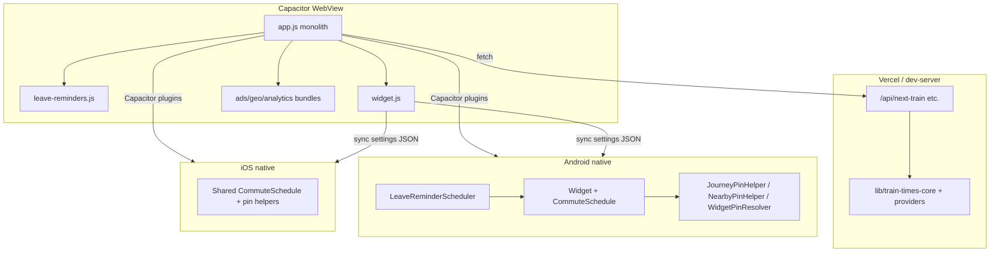

# Codebase inventory — refactor & rationalisation guide

**Owner:** Tim (product)  
**Date:** 15 Aug 2026  
**Status:** Phase 0 complete · Phase 1 in progress (FB-24)  
**Related:** `docs/dead-code-inventory.md` · `docs/feature-backlog.md` · `docs/multi-city-provider-design.md` · `docs/release-versioning.md`

---

## Executive summary

The codebase is **large but not messy** — growth tracks real product surface (Near me, journeys, pin, reminders, widget, onboarding, template wizard). The main pain is **concentration**, not junk:

1. **`public/app.js` (~8,430 lines after FB-25 2.1–2.3; was ~8,800)** holds most client logic. FB-25 Phase 2 extraction in progress (`station-combobox.js`, `journey-model.js`, `train-navigation.js` extracted Aug 2026).
2. **Commute/pin rules exist in three places** (web, Android widget, iOS widget) by design — maintenance cost is real; unification is not free.
3. **QA is strong for a solo/small team** (66 web scripts, 11 Android unit test classes, Maestro) — use it as the gate for any refactor.
4. **Runtime efficiency is fine** for now; refactors should target **bug prevention and change velocity**, not micro-optimisation.
5. **Best timing:** finish **v2.2.0 pin ship**, then slice refactors **before FB-23** (Route vs Commute) or city #2.

---

## Scale snapshot

| Layer | Size | Notes |
|-------|------|-------|
| `public/app.js` | ~8,430 lines | Monolith (shrinking); journey + nearby + pin + settings + wizards |
| `public/station-combobox.js` | ~470 lines | Station typeahead/combobox (FB-25 2.1) |
| `public/journey-model.js` | ~485 lines | Journey settings normalize/migrate/persist (FB-25 2.2) |
| `public/train-navigation.js` | ~1,320 lines | Skip/swipe/pin navigation + journey pin state (FB-25 2.3) |
| `public/styles.css` | ~3,700 lines | Sectioned by comment headers; ~130 nearby/journey/leave selectors |
| `public/index.html` | ~1,120 lines | Main shell + settings/journeys dialogs |
| `public/leave-reminders.js` | ~750 lines | Reminders UI + native bridge (reasonable split) |
| `public/widget.js` | ~430 lines | Widget sync + deep links (reasonable split) |
| `lib/` (server/shared) | ~2,400 lines | Providers, train-times core, fixtures — healthier shape |
| `api/` + Netlify functions | Thin handlers | Delegate to `lib/` |
| Android `app/src/main/java` | ~5,600 lines | Widget, reminders, schedule — `CommuteSchedule.java` largest (~1,080) |
| iOS `Shared/` | ~1,100 lines | Parity subset of Android schedule/pin |
| QA `*.mjs` | 66 scripts | Smoke + repro + regression |
| Android unit tests | 11 classes | Pin, schedule, widget, preview |

**Bundles:** `*-native.mjs` → esbuild → `*-bundle.js` (ads, geo, analytics, train-times). Keep sources + bundles unless packaging cleanup (see `docs/dead-code-inventory.md` D-05).

---

## Architecture (today)

**Healthy seams already exist:** server `lib/`, `leave-reminders.js`, `widget.js`, native pin helper classes. **Missing seam:** most UI orchestration still lives in one file.

---

## `public/app.js` — domain map

Approximate regions (line numbers drift; use search when splitting):

| Region | ~Lines | Functions (indicative) | Extraction candidate |
|--------|--------|--------------------------|----------------------|
| DOM refs, constants, module state | 1–270 | — | `app-state.js` or keep at top |
| Analytics, geo, dialogs, API URL | 270–610 | `trackProductEvent`, `openAppDialog`, `getAppGeolocationPosition` | `dialogs.js`, `geo.js` |
| Journey model + settings migrate | 610–1,180 | `normalizeJourney`, `migrateSettings`, `journeyMatchesSchedule` | **`journey-model.js`** |
| Mode switch + onboarding | 1,180–1,660 | `applyCommuteMode`, `maybeScheduleOnboarding` | **`onboarding.js`** |
| Settings persist, active hours, leave-before UI | 1,660–2,850 | `persistSettings`, `syncLeaveBeforeSliderFill` | `journey-settings.js` |
| Preferred target, display prep, pin resolution | 2,850–3,400 | `prepareDisplayData`, `resolveJourneyPinTrip` | **`pin-display.js`** |
| Skip / swipe / journey switcher | 3,400–3,800 | `skipToNextTrain`, `applyClientSkip`, `isHeroPinLockingSwipe` | **`train-navigation.js`** |
| Fetch + countdown render helpers | 3,800–4,370 | `fetchJson`, `renderLeaveMinutesCountdown` | `render-helpers.js` |
| Main `render()` — journey hero | 4,370–5,030 | `render`, `enterJourneyMode` | **`journey-face.js`** |
| Near me board + pin + locate | 5,030–6,400 | `renderNearbyBoard`, `enterNearbyMode`, `toggleHeroPin` (nearby branch) | **`nearby-mode.js`** |
| Live fetch loop | 6,400–6,800 | `fetchNextTrain`, `fetchNearbyBoard` | `live-fetch.js` |
| Station combobox | 6,800–7,250 | `createStationCombobox` | **`station-combobox.js`** (self-contained ~400 lines) |
| Journeys dialog + sheet chrome | 7,250–7,360 | `openJourneys`, `syncJourneysDialogSheetMode` | `journeys-dialog.js` |
| Template wizard | 7,360–8,730 | `renderTemplateWizardStep`, coach positioning | **`template-wizard.js`** |
| Journey detail form | 8,730–9,100 | `populateJourneyDetailForm`, `saveJourneyDetailFromForm` | **`journey-detail.js`** |
| Journey list, menu, listeners, `init()` | 9,100–10,120 | Event wiring, `window.nextTrainApp` test API | `app-init.js` |

**Rough function counts by keyword** (overlapping): detail/journey ~116, nearby ~68, pin/skip/preferred ~50, render/fetch/leave ~44, template wizard ~35, onboarding ~30.

**Test hook:** `window.nextTrainApp` exports ~30 functions for QA — preserve or re-export from a thin `app-test-api.js` when splitting.

---

## Cross-platform duplication matrix

| Concern | Web (`app.js`) | Android | iOS | Notes |
|---------|----------------|---------|-----|-------|
| Trip list / leave-by math | `prepareDisplayData`, `lib/train-times-core` | `CommuteSchedule.java` | `CommuteSchedule.swift` | Server uses `lib/`; client + widgets duplicate |
| Journey pin resolution | `resolveJourneyPinTrip` | `JourneyPinHelper` | `JourneyPinHelper` | New FB-20 work — keep in sync |
| Nearby pin | `getNearbyPin`, session state | `NearbyPinHelper` | `NearbyPinHelper` | |
| Widget face priority | `WidgetPinResolver` (via settings) | `WidgetPinResolver` | `WidgetPinResolver` | Near me pin > journey pin |
| Perth time / day keys | `getPerthDayOfWeekIso` etc. | `PerthTime.java` | `PerthTime.swift` | |
| Direction collapse | `LINE_DIRECTION_GROUPS` in app | (widget uses journey direction string) | same | Also in `lib/train-times-core.js` |
| Preferred-or-later filter | **Removed from app** | `resolveActiveNextTrip` still named in native | same | Widget uses true next + pin; names are legacy |

**Do not** try to single-source widget logic into JS — widgets must run without WebView. **Do** add **shared JSON fixtures + expected outputs** tested in JS unit tests (new), Java, and Swift.

---

## Parked, dead, and confusing code

See **`docs/dead-code-inventory.md`** (last trawl 11 Aug 2026). Still accurate; add:

| ID | Artefact | Notes |
|----|----------|-------|
| **D-09** | `#preferred-hint` + `jumpToTargetTrain()` / `skipToTargetTrain()` | **Resolved — kept active** (Aug 2026). Jump hint visible when hero preview ≠ pin; `skipToTargetTrain` sets skip index; `jumpToTargetTrain` clears skip. |
| **D-10** | `PRO_MONETIZATION_SHIPPED = false` branches | Entire pro/paywall UI gated — fine for ship; grep before FB-13. |
| **D-11** | `applyPreferredOrLaterFilter` | Gone from `app.js`; FB-06 doc updated Aug 2026 — hygiene closed. |
| **D-12** | `public/design/*.html` in APK | Design pickers (pin icon, etc.) — same class as D-05. `target-icon-pick.html` obsolete (FB-17 superseded). |

**Confirmed live (do not delete):** `CommuteRefreshService`, `applyCommuteMode()`, strip/reminder schedulers, all widget receivers — see dead-code doc table.

---

## QA & test coverage

| Layer | What exists | Gaps |
|-------|-------------|------|
| Web QA | 67 scripts; `npm run test:web` / `--smoke` | Pin/swipe/notify covered by `qa/pin-swipe-notify.mjs` + `leave-by-preferred-gate.mjs` |
| Browser smoke | `smoke-browser.mjs`, onboarding, ads-above-content | No automated visual regression |
| Android unit | Schedule, pin helpers, widget preview, strip scheduler | No tests for `LeaveReminderScheduler` size (~600 lines) |
| iOS | Maestro preflight | Less unit coverage than Android |
| Maestro | `qa/maestro/flows/smoke-app-opens.yaml` | Device E2E not in every PR |

**Refactor rule:** any `app.js` split must keep `window.nextTrainApp` stable or update QA imports in the same PR.

---

## Highest-risk interaction zones

Bugs here are **integration** bugs (like pin + swipe), not isolated function bugs:

1. **Pin state machine** — `skipTrains`, `journeyPinOverride*`, `journeyPinDismissed*`, nearby `pin*` session, `shouldAdvancePinOnNextTrain` vs `isHeroPinLockingSwipe`.
2. **Mode switching** — `journeyModeActive`, `applyCommuteMode`, `enterNearbyMode`, widget deep link entry.
3. **Leave card visibility** — journey `journeyMatchesSchedule` vs nearby pin; CSS `!important` history on `.leave-card`.
4. **Display pipeline** — `lastApiData` → `prepareDisplayData` → `applyClientSkip` → `render` vs `renderNearbyBoard`.
5. **Settings draft vs live** — `settingsDraftJourneys` during journeys dialog edit.

**Recommendation:** one short internal doc or module comment diagram for (1) before more pin features.

---

## Ordered refactor backlog

Prioritised by **ROI / risk reduction**, not by “cleanliness”. Effort = Tim+agent or Jim days.

### Phase 0 — Ship gate (now)

| # | Task | Effort | ROI | Status |
|---|------|--------|-----|--------|
| 0.1 | Land v2.2.0 pin (FB-14 + FB-20 partial) | — | Product | **Done** (v2.2.0/11) |
| 0.2 | Run `npm run test:pre-release` before Play upload | Hours | Regression safety — web smoke + `WidgetUiBuilderTest` / `CommuteScheduleTest` | **Done** (Aug 2026 gate) |

### Phase 1 — Quick wins (1–2 days, low risk)

| # | Task | Effort | ROI | Status |
|---|------|--------|-----|--------|
| 1.1 | Execute `docs/dead-code-inventory.md` D-03, D-04 (CSS hooks, ads LS key) | S | Less noise | **Done** (Aug 2026) |
| 1.2 | Resolve D-09: delete or restore preferred-hint UI | S | Less confusion | **Done — kept active** (Aug 2026) |
| 1.3 | Doc pass: FB-06 references, QA doc dates | S | Onboarding future you | **Done** (Aug 2026) |
| 1.4 | Add `qa/pin-swipe-notify.mjs` covering pin-lock swipe + Next Train advance | M | Locks recent bug class | **Done** (Aug 2026) |

### Phase 2 - Extract modules from `app.js` (3-5 days, medium risk)

Do **one PR per module**; run full web QA each time.

**Architecture decision (FB-25, Aug 2026):** Option A - plain script files + `window.nextTrain*` globals, loaded in `index.html` before `app.js`. Shared state (`settings`, DOM refs, timers) stays in `app.js`; modules receive deps via `init(deps)`. Not esbuild bundle yet.

| # | Module | ~Lines | Depends on | Status |
|---|--------|--------|------------|--------|
| 2.1 | `station-combobox.js` | 470 | DOM root, `formatStationLabel` via deps | **Done** (Aug 2026) |
| 2.2 | `journey-model.js` | 485 | Settings normalize/migrate; station/direction via deps | **Done** (Aug 2026) |
| 2.3 | `train-navigation.js` | 1,320 | Pin, skip, swipe; `render()` via deps | **Done** (Aug 2026) |
| 2.4 | `nearby-mode.js` | 1,400 | Geo, board, pin session | **Blocked** - geo + chrome + journey mode |
| 2.5 | `template-wizard.js` | 1,400 | Journey detail, coach DOM | **Blocked** - interleaved with detail form |
| 2.6 | `journey-detail.js` | 400 | Combobox, directions API | **Blocked** - overlaps wizard + reminders |

**Tooling:** Option A for now (no bundle). Revisit esbuild when 2.3+ unblocked.

### Phase 3 — Pin / display contract (2–3 days, high value)

| # | Task | Effort | ROI |
|---|------|--------|-----|
| 3.1 | Single `pin-state.js` (web) documenting all inputs/outputs | M | Fewer swipe/button divergences |
| 3.2 | Shared fixture file: `qa/fixtures/pin-resolution/*.json` | M | Web + Android + iOS same vectors |
| 3.3 | Align naming: `resolveActiveNextTrip` vs “true next” in native comments | S | Clarity |

### Phase 4 — Before FB-23 or city #2 (1–2 weeks)

| # | Task | Effort | ROI |
|---|------|--------|-----|
| 4.1 | Journey kind (`route` vs `commute`) in model layer only | L | FB-23 foundation |
| 4.2 | Split `styles.css` by domain (nearby, journey-detail, dialogs) | M | Parallel UI work |
| 4.3 | Packaging: D-05 move `design/` + `.mjs` sources out of APK `webDir` | M | Smaller AAB |
| 4.4 | `CommuteSchedule.java` decomposition (preview vs schedule vs pin) | L | Widget maintainability |

### Phase 5 — Defer / low ROI

| # | Task | Why defer |
|---|------|-----------|
| 5.1 | Full CSS purge / design token system | No user-visible win pre-launch |
| 5.2 | Rewrite native widget in Kotlin/SwiftUI | Massive risk |
| 5.3 | Convert entire app to TypeScript | Huge diff; QA noise |
| 5.4 | Micro-optimise render/countdown timers | No measured problem |

---

## What not to do

- **No big-bang rewrite** of `app.js` in one PR.
- **No “efficiency” pass** on fetch intervals or DOM without profiling.
- **No merging** Android and iOS widget codebases.
- **No deleting** native schedule logic in favour of web-only — widget must stay offline-capable.
- **No refactor sprint** during Play closed-test firefighting — use Phase 1 only.

---

## Suggested triggers

| Trigger | Start |
|---------|--------|
| v2.2.0 tagged and on testers | Phase 1 |
| First FB-23 brief draft | Phase 2.1–2.3 + 4.1 |
| Second pin/widget bug from swipe/notify mismatch | Phase 3.1 immediately |
| City #2 adapter work | Phase 2 + `lib/` only; keep `app.js` city-agnostic |
| Public launch | Phase 4.3 + D-08/D-05 packaging |

---

## Change log

| Date | Note |
|------|------|
| 2026-08-14 | First inventory (post v2.2.0 pin work, pre-ship) |
