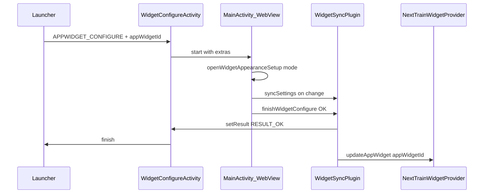

# Jim brief: Widget setup on placement + wallpaper preview

**For:** Jim (implement)  
**From:** Simon (design) / Tim (product) / Holly (marketing)  
**Status:** Implemented (2026-08-16)  
**Backlog:** **FB-37**  
**Prerequisite:** **FB-35** (presets) shipped; **FB-36** (opacity + transparent) shipped or in same release  
**Related:** `docs/jim-brief-widget-colour-presets.md`, `docs/jim-brief-widget-appearance-opacity.md`, `public/widget.js`, `WidgetSyncPlugin.java`, `next_train_widget_info.xml`  
**Out of scope:** iOS WidgetKit configure flow; per-widget-instance themes; rebuilding picker in native XML; full app theme (**FB-01**); free-form colour picker

**Estimate:** 4–6 dev days (2a configure shell ~2–3d + 2b wallpaper hero preview ~1.5d — can ship 2a first if timeboxed)

---

## 1. Problem

FB-35/36 let users customise the widget from **Menu**, but:

1. **Drag-from-launcher** placement drops a **default white** widget with no setup step — users never discover appearance.  
2. **In-app pin** (`requestPinAppWidget`) also skips setup.  
3. Mini swatches in a dialog don’t show how the widget looks on **real wallpapers** — the “meh” feedback.

Top utility widgets (Widgetsmith, Overdrop) open **customise on first add** and preview on sample backgrounds.

---

## 2. Goal (one sentence)

When a user adds the widget from the launcher, open the **same appearance picker** (presets + opacity) in a **setup flow** with a **large preview on wallpaper backdrops**; cancel aborts placement; in-app pin path opens setup once after a successful pin.

---

## 3. Locked decisions

| ID | Choice |
|----|--------|
| **S1** | Register **`APPWIDGET_CONFIGURE`** — dragging a new widget from the launcher **must** open setup **before** the widget is confirmed on the home screen. |
| **S2** | **Wallpaper preview** — hero mock floats over **three** selectable backdrops: **Dark**, **Light**, **Vibrant** (bundled assets). Preview is cosmetic only; does not change native paint. |
| **S3** | **Reuse web UI** — one shared appearance module (`widget.js`); do **not** duplicate picker in native XML. |
| **S4** | **Configure hosts MainActivity** (Capacitor WebView) with intent extras — not a separate minimal WebView unless MainActivity bridge proves impossible. |
| **S5** | **Done** → `RESULT_OK` + `EXTRA_APPWIDGET_ID`; **Back / cancel** → `RESULT_CANCELED` (widget **not** placed). |
| **S6** | **Pin parity:** after `requestPinWidget` returns `requested: true`, **auto-open** appearance setup once (same UI as configure, without `appWidgetId` result contract). |
| **S7** | Settings remain **global** (`widgetThemeId`, `widgetBgOpacity`, `widgetTransparentBg`) — configure does not store per-`appWidgetId` theme (v1). |
| **S8** | **Menu → Widget appearance** unchanged — edit anytime; configure is additive onboarding. |
| **S9** | **Not paywalled.** |

---

## 4. Android native — configure activity

### 4.1 Manifest + provider

**New:** `WidgetConfigureActivity.java` (can be thin wrapper).

[`AndroidManifest.xml`](android/app/src/main/AndroidManifest.xml):

```xml
<activity
    android:name=".WidgetConfigureActivity"
    android:exported="true"
    android:theme="@style/AppTheme.NoActionBarLaunch"
    android:screenOrientation="portrait">
    <intent-filter>
        <action android:name="android.appwidget.action.APPWIDGET_CONFIGURE" />
    </intent-filter>
</activity>
```

[`next_train_widget_info.xml`](android/app/src/main/res/xml/next_train_widget_info.xml):

```xml
android:configure="com.tdrevans.nexttrain.WidgetConfigureActivity"
```

### 4.2 Flow



1. `WidgetConfigureActivity.onCreate` reads `EXTRA_APPWIDGET_ID`. Invalid id → `RESULT_CANCELED` + finish.  
2. Start `MainActivity` with extras (see §4.3). `WidgetConfigureActivity` stays on back stack **or** use `singleTask` + `onNewIntent` — Jim picks; must return result to launcher.  
3. User taps **Done** in setup UI → JS calls native `finishWidgetConfigure({ ok: true })`.  
4. Native sets `setResult(RESULT_OK, intent with EXTRA_APPWIDGET_ID)`, finishes configure activity, triggers widget paint for that id.  
5. User presses **system back** or **Cancel** (if shown) → `finishWidgetConfigure({ ok: false })` → `RESULT_CANCELED`.

**Orphan prevention:** If `RESULT_CANCELED`, launcher must not leave a broken widget — standard Android behaviour; verify on Pixel + Samsung.

### 4.3 Intent extras (MainActivity)

| Extra | Type | Purpose |
|-------|------|---------|
| `nexttrain_widget_configure` | boolean | `true` = setup mode |
| `nexttrain_widget_configure_id` | int | `appWidgetId` from configure |

Expose to JS via `WidgetSyncPlugin.getWidgetConfigureContext()`:

```json
{ "active": true, "appWidgetId": 42, "cancellable": true }
```

### 4.4 New plugin methods

| Method | Purpose |
|--------|---------|
| `getWidgetConfigureContext` | JS reads whether we're in configure mode + appWidgetId |
| `finishWidgetConfigure({ ok: boolean })` | Ends configure activity with OK/CANCELED; on OK refresh widget id |

Store pending configure state in `WidgetConfigureActivity` or plugin static until finish.

---

## 5. Web UI — setup mode + wallpaper preview

### 5.1 Shared module

Refactor [`public/widget.js`](public/widget.js):

- `openWidgetAppearanceDialog({ mode: 'edit' })` — current Menu behaviour (dialog, **Done** only closes).  
- `openWidgetAppearanceSetup({ appWidgetId?, source: 'configure' \| 'pin' })` — fullscreen or full-page sheet:
  - Same controls: preset grid + opacity slider + transparent toggle (**FB-36**).  
  - **Hero preview** (required) — large widget mock above grid.  
  - **Wallpaper bar** — three buttons: Dark / Light / Vibrant.  
  - Primary button: **Add widget** (configure) or **Done** (pin follow-up) — label by source.  
  - Configure mode: back = cancel (calls `finishWidgetConfigure(false)`).

### 5.2 Hero preview (S2)

DOM sketch:

```html
<div class="widget-appearance-hero" id="widget-appearance-hero">
  <div class="widget-wallpaper-backdrop" data-wallpaper="dark|light|vibrant"></div>
  <div class="widget-appearance-hero-mock" id="widget-appearance-hero-mock">
    <!-- mirrors real widget hierarchy: NEXT TRAIN · 3 min · Leave in 8 min -->
  </div>
</div>
<div class="widget-wallpaper-switcher" role="tablist" aria-label="Preview wallpaper">
  <button type="button" data-wallpaper="dark">Dark</button>
  <button type="button" data-wallpaper="light">Light</button>
  <button type="button" data-wallpaper="vibrant">Vibrant</button>
</div>
```

- Hero mock updates live when preset / opacity changes (reuse `WIDGET_THEME_PRESETS` + opacity helpers).  
- Apply `text-shadow` on hero mock when opacity &lt; 50% (CSS only — mirrors native legibility intent).  
- Mini grid swatches **also** update (existing behaviour).

### 5.3 Wallpaper assets

Bundle three images (~1080×1920 crop or tile-safe):

| Key | File (suggested) | Intent |
|-----|------------------|--------|
| `dark` | `public/assets/widget-preview-wallpaper-dark.webp` | Near-black gradient |
| `light` | `public/assets/widget-preview-wallpaper-light.webp` | Soft off-white |
| `vibrant` | `public/assets/widget-preview-wallpaper-vibrant.webp` | Blue/purple photo-style (Holly marketing alignment) |

Simon may supply finals; Jim can use placeholders with correct aspect ratio for v1 QA.

Persist last selected preview wallpaper in `sessionStorage` only (not synced to widget).

### 5.4 Copy (locked)

| Context | Title | Primary button | Hint |
|---------|-------|----------------|------|
| Configure (launcher) | **Set up your widget** | **Add widget** | **Preview on different wallpapers, then add to your home screen.** |
| Menu edit | **Widget appearance** | *(none — Done in footer)* | **Choose how your home screen widget looks. The app stays the same.** |
| Pin follow-up | **Set up your widget** | **Done** | Same as configure |

### 5.5 MainActivity boot

On `deviceready` / app init:

1. Call `getWidgetConfigureContext()`.  
2. If `active` → `openWidgetAppearanceSetup({ appWidgetId, source: 'configure' })` **before** normal deep-link / coach flow.  
3. Hide main chrome (hero, ads) while in setup mode — fullscreen picker only.

---

## 6. Pin path parity (S6)

In `requestPinWidget()` after `requested === true`:

```js
window.setTimeout(() => {
  openWidgetAppearanceSetup({ source: 'pin' });
}, 400);
```

- No `finishWidgetConfigure` — widget already placed.  
- **Done** closes setup; settings already synced on each change.  
- Do not auto-open if user already customised this session (optional `sessionStorage` guard).

---

## 7. Native widget refresh

On configure **Done**:

1. `syncSettings` (latest theme + opacity).  
2. `AppWidgetManager.updateAppWidget(appWidgetId, …)` for the new id.  
3. Existing `CommuteRefreshService.refreshAll` OK for global settings but **must** update the new id immediately so first paint matches preview.

---

## 8. QA

### Manual (`TESTING.md`)

1. Launcher → Widgets → Next Train → drag to home → **setup opens** before placement completes.  
2. Pick Ocean + 40% opacity on Vibrant preview → **Add widget** → home widget matches.  
3. Back out of setup → **no widget** on home screen.  
4. Menu → Widget appearance → still editable; same settings.  
5. In-app **Add widget** pin → after system pin sheet, setup opens once.  
6. Re-add second widget instance (if supported) → configure runs again (same global theme applied).

### Automated

| Script | Scope |
|--------|--------|
| `qa/widget-appearance-setup.mjs` (new) | Web: hero preview + wallpaper switcher updates mock styles; settings persist |
| Maestro (optional) | `flows/widget-configure.yaml` — drag widget; limited on emulators |

Configure cancel/placement is **device-manual** gate (Pixel + Samsung).

---

## 9. Acceptance checklist

- [ ] `android:configure` registered; drag-add opens setup.  
- [ ] Cancel/back → `RESULT_CANCELED`; no orphan widget.  
- [ ] Done → `RESULT_OK`; widget on home with chosen preset + opacity.  
- [ ] Hero preview + Dark/Light/Vibrant switcher updates live.  
- [ ] Menu edit path still works (regression).  
- [ ] Pin path opens setup once after successful pin.  
- [ ] Web build: no configure UI (native only).

---

## 10. Files (expected)

| File | Change |
|------|--------|
| `WidgetConfigureActivity.java` | New |
| `AndroidManifest.xml` | Configure activity |
| `next_train_widget_info.xml` | `android:configure` |
| `WidgetSyncPlugin.java` | `getWidgetConfigureContext`, `finishWidgetConfigure` |
| `MainActivity.java` | Forward configure intent to bridge |
| `public/widget.js` | Setup mode, hero preview, pin follow-up |
| `public/index.html` | Hero + wallpaper switcher markup (dialog or fullscreen template) |
| `public/styles/widget-appearance.css` | Hero, wallpaper bar, fullscreen setup |
| `public/assets/widget-preview-wallpaper-*.webp` | Three backdrops |
| `qa/widget-appearance-setup.mjs` | New |
| `TESTING.md` | Configure + preview rows |

---

## 11. Sequencing

| Phase | Ships |
|-------|--------|
| **FB-36** | Opacity + transparent (prerequisite for complete picker) |
| **FB-37a** | Configure activity + setup mode + Done/Cancel (hero can use flat bg first) |
| **FB-37b** | Wallpaper switcher + bundled assets (same release if possible) |

---

## 12. Non-goals (v2+)

- Re-configure long-press on existing widget (Android reconfigure intent)  
- Per-instance themes when multi-journey widgets ship  
- Live blur of user’s actual home wallpaper (privacy + API)
